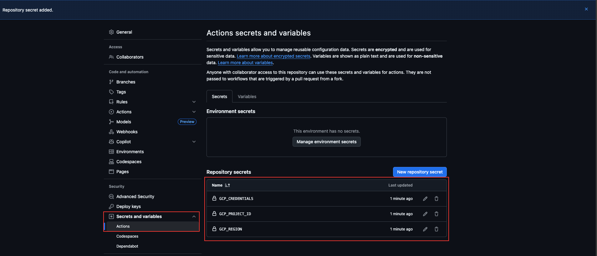
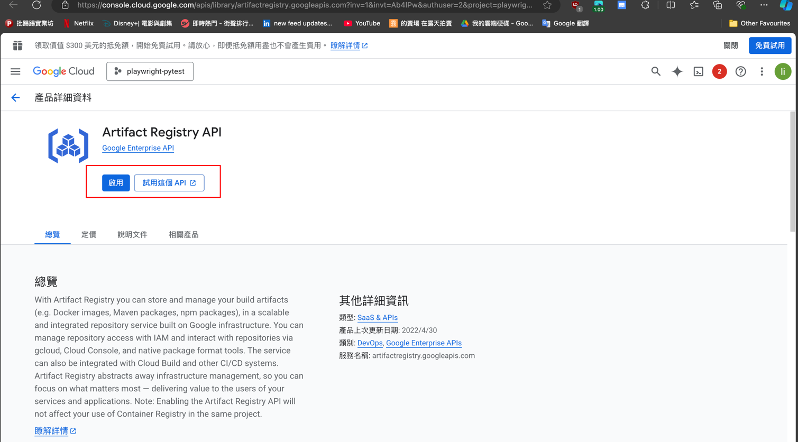
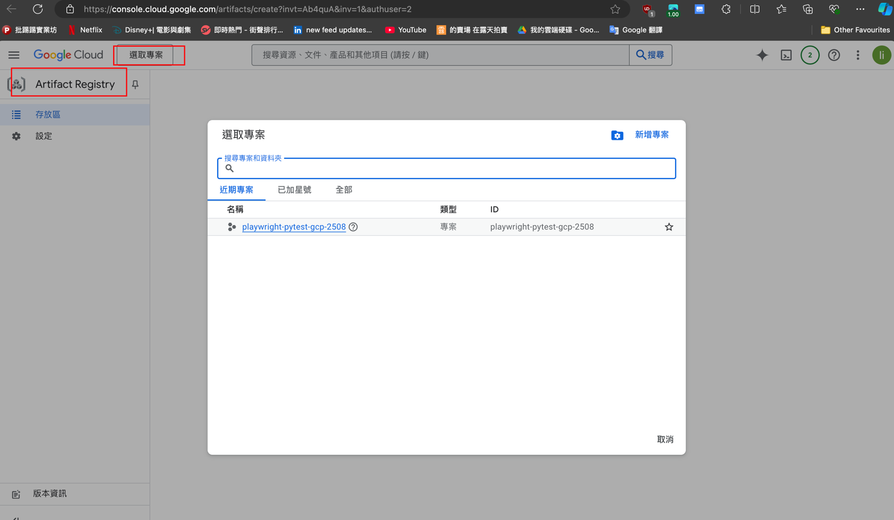
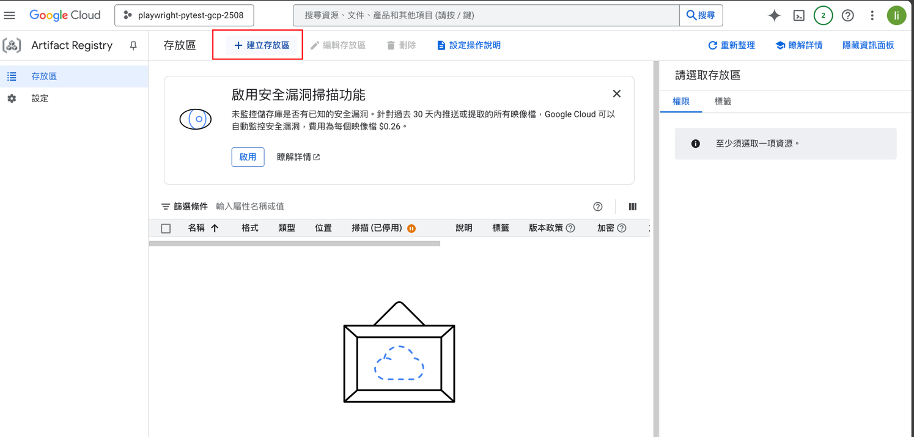
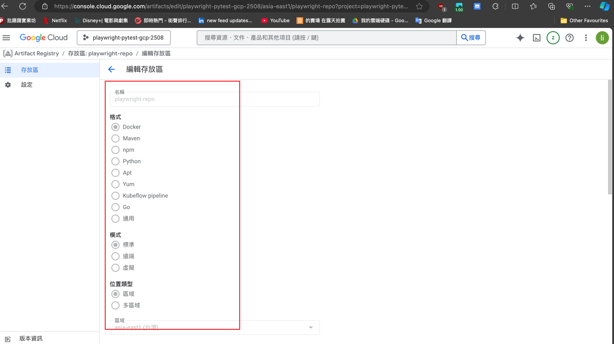

# -automation_ui_playwright_pytest


Generate GCP Key
```aiexclude
playwright-pytes
t-gcp-2508
# 設定環境變數

export PROJECT_ID=[YOUR_PROJECT_ID]
export ACCOUNT_NAME=terraform-ci

# 登入你的 GCP CLI
gcloud auth login
gcloud config set project $PROJECT_ID

# 建立 Service Account
gcloud iam service-accounts create $ACCOUNT_NAME \
  --display-name="Terraform GitHub CI"

# 賦予權限
gcloud projects add-iam-policy-binding $PROJECT_ID \
  --member="serviceAccount:$ACCOUNT_NAME@$PROJECT_ID.iam.gserviceaccount.com" \
  --role="roles/editor"

# 產生金鑰
gcloud iam service-accounts keys create terraform-ci.json \
  --iam-account=$ACCOUNT_NAME@$PROJECT_ID.iam.gserviceaccount.com

```

```aiexclude
設定 GitHub Secrets：

GCP_CREDENTIALS：貼上 terraform-ci.json 內容（整個 JSON 貼進去）

GCP_PROJECT_ID：填你的 Project ID

GCP_REGION：建議 asia-east1（台灣最近的區域）

是 Action 的 env 還是 repo secrest
```



Enable Artifact Registry API
https://console.cloud.google.com/apis/library/artifactregistry.googleapis.com?inv=1&invt=Ab4lPw&authuser=2&project=playwright-pytest&flow=gcp


```
gcloud auth login
gcloud auth configure-docker asia-east1-docker.pkg.dev
make docker-build-prod
```




asia-east1-docker.pkg.dev/playwright-pytest-gcp-2508/playwright-repo
