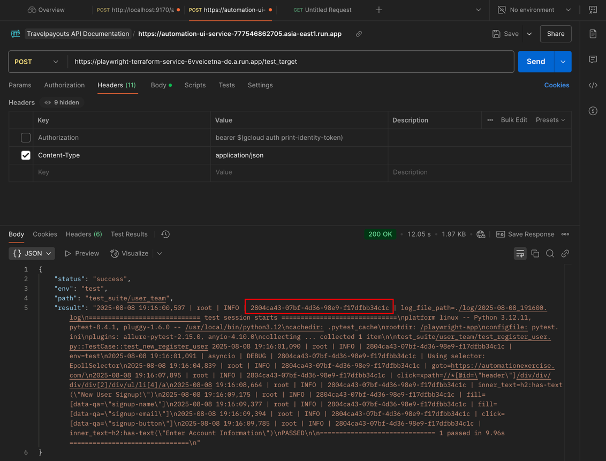
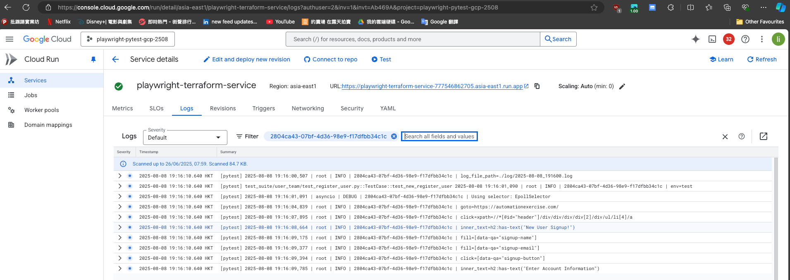
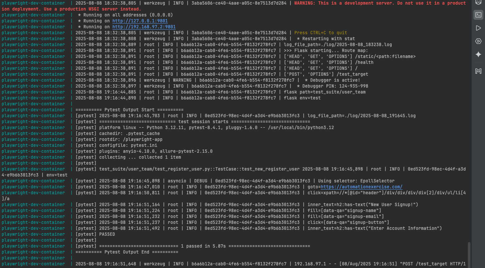

# Automation UI - Playwright, Terraform, Google Cloud


## Table of Contents
- [Stack](#stack)
- [Project Structure](#project-structure)
- [Quick Start](#quick-start)
- [Operation](#operation)

## Stack
- **Language**: Python 3.12+ (Poetry for dependency management)
- **Testing**: Playwright, Pytest, Allure
- **Test data**: https://automationexercise.com/
- **Service**: Flask (exposes `/test_target` to run tests)
- **Container**: Docker / docker‑compose (for dev mode)
- **Cloud**: Google Cloud Run + Artifact Registry
- **IaC**: Terraform
- **CI/CD**: GitHub Actions

## Project Structure
```commandline
.
├── api
├── config
│   ├── prod.ini
│   ├── test.ini
│   └── uat.ini
├── conftest.py
├── database
├── deployment
│   ├── Dockerfile
│   ├── docker-compose-dev.yml
│   └── terraform
├── flask_app
│   └── trigger_automation.py
├── infra
│   ├── api_request.py
│   ├── config.py
│   ├── mongo_database.py
│   └── playwright_driver.py
├── makefile
├── page
│   ├── home_page
│   ├── login_page
│   └── signup_page
│   └── ...
├── poetry.lock
├── pyproject.toml
├── pytest.ini
├── readme
├── readme.md
├── test_suite
│   ├── user_team
│   ├── xxx_team
│   └── z_repo_unit
└── utils
    └── logger.py
```

## Quick Start
### DEV Mode 
```commandline
$ make run-dev-docker
```

### Setup Terraform & Google Cloud
Kindly ref. https://github.com/taurus5650/terraform_gcp_practice_step_by_step

## Operation
- If PROD (everyone able to trigger the automation UI feature)
```commandline
curl --location 'https://playwright-terraform-service-6vveicetna-de.a.run.app/test_target' \
--header 'Content-Type: application/json' \
--data '{
    "path": "user_team",
    "env": "test"
}'
```



- If DEV mode (development by SDET)
```commandline
curl --location 'http://localhost:9180/test_target' \
--header 'Content-Type: application/json' \
--data '{
    "path": "user_team",
    "env": "test"
}'
```



